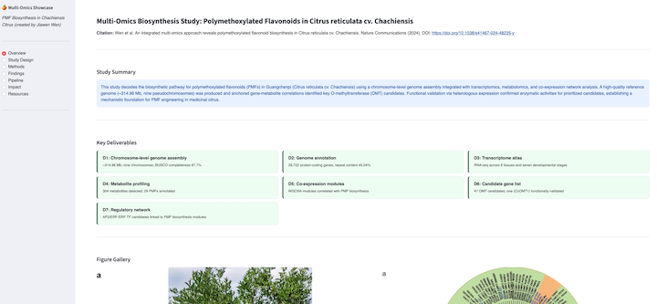

# Multi-Omics Showcase — Polymethoxylated Flavonoids in Citrus reticulata cv. Chachiensis
Wen et al. An integrated multi-omics approach reveals polymethoxylated flavonoid biosynthesis in Citrus reticulata cv. Chachiensis. 
Nature Communications (2024). DOI: https://doi.org/10.1038/s41467-024-48235-y

## Folder Structure

```
multiomics_app/
├── app.py                  # Main Streamlit application (single file)
├── content_config.yaml     # All text content, citations, findings, impact — edit here
├── requirements.txt        # Python dependencies
├── assets/                 # Place figure images here (PNG/SVG)
│   └── .gitkeep
└── README.md               # This file
```

---

## Streamlit Community Cloud Deployment Checklist

### Streamlit Cloud setup
- [ ] Go to share.streamlit.io → "New app"
- [ ] Connect your GitHub repo
- [ ] Set **Main file path**: `app.py`
- [ ] Set **Python version**: 3.10 or 3.11
- [ ] Click Deploy

### Post-deployment
- [ ] Verify all sidebar pages render without errors
- [ ] Share URL with collaborators for review

---

## Customization Guide

### Adding real figures
```python
# In page_overview(), replace placeholder with:
st.image("assets/fig1_genome.png", caption="Fig. 1 — Hi-C contact map and assembly statistics")
```

### Updating content without touching code
Edit `content_config.yaml` only. All text blocks, deliverable descriptions, 
finding claims, impact bullets, and resource links are driven from that file.

### Adding a new page
1. Add page name to `PAGES` list in `app.py`
2. Write a `page_newname()` function
3. Add entry to `router` dict
### Output
https://citrus-pmf-multiomics-uu8kbtpvogdduqwkycyeyw.streamlit.app/


